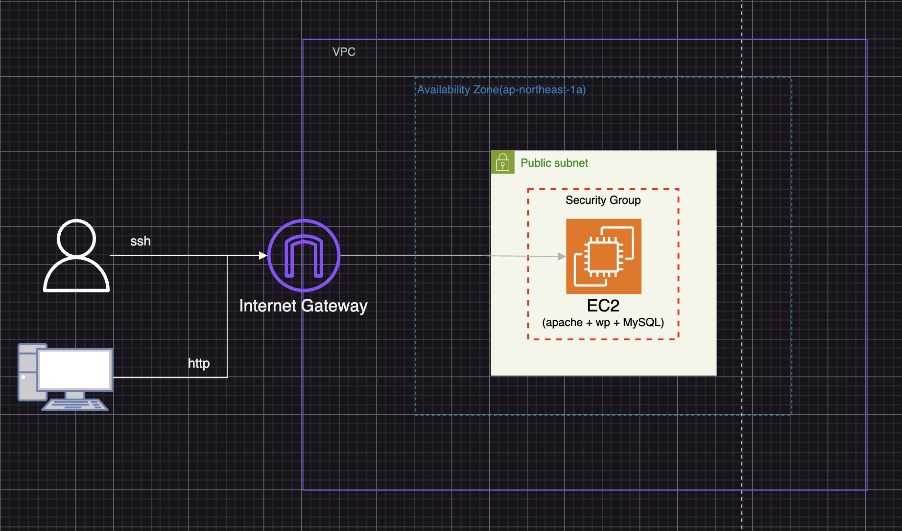

# 架空の CP サイトを運用するための設計を行う

以下の観点で運用前の構成の改修を行う

- セキュリティ
- 負荷に対する強度
- 運用を考慮した構成
- 監視
- 設計するコスト
  - WordPress、AWS、CP サイトの特性を良く理解した上で、 「最低限コストはこのくらい、これとこれをオプションで付けると、 こう言った物まで出来るが、そのメリットはこれくらい。」 と提案できる

宿題のヒント
• ALB ＋ SSL くらいは必ず導入
• CI/CD は GithubActions
• 「WordPress セキュリティ」とかでググって、どんな対応をすべきか調べる
• インフラエンジニアには「サービス・Web アプリ・クラウドインフラ」を幅広く知識として無きゃ行けない事を理解して、解らない事は良く調べる

### 運用前の構成

### 運用後の構成
