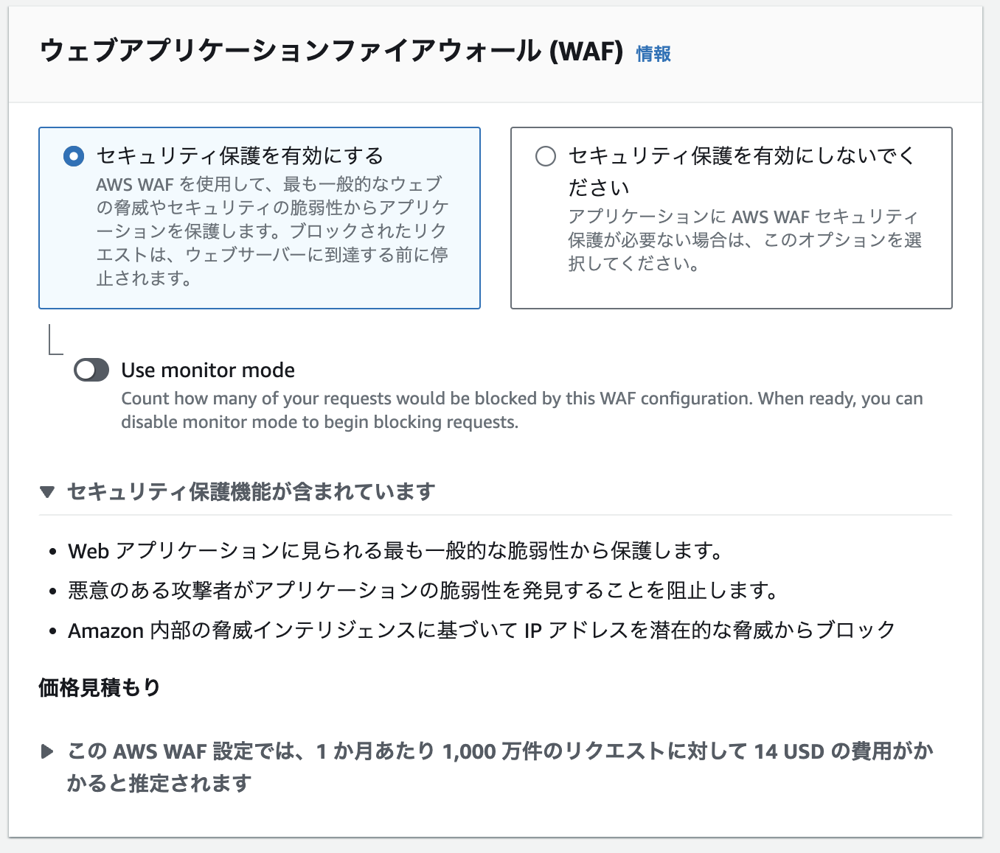
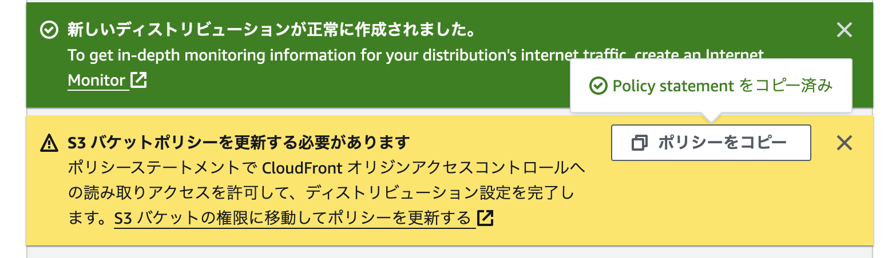

# 2.CloudFront での設定

## 2.1 OAC を作成

- オリジンアクセスのコントロール設定に移動
- Create new OAC
  - 名前
    - my-app-prod-oac
  - オリジンタイプ
    - S3

## 2.2 CloudFront ディストリビューションを作成

- オリジンドメイン
  - my-app-prod.s3.ap-northeast-1.amazonaws.com
- オリジンアクセス
  - Origin access control settings (recommended)
- Origin access control
  - my-app-prod-oac(2.1 で作成)
- デフォルトのキャッシュビヘイビア
  - パスパターン
    - デフォルト(\*)
  - オブジェクトを自動的に圧縮
    - yes
  - ビュワー
    - HTTPS only
    - TODO: ここが stg の場合は HTTP も許容する？
  - 許可された HTTP メソッド
    - GET, HEAD
  - ビューワーのアクセスを制限する
    - No
    - TODO: ここが Yes をしてアクセスを制限する?
  - TODO: その他のオプションは今後調べて設定するかを選択する
  - WAF を有効にする
    - TODO: 詳細の内容は調べて理解する
      
  - TODO: SSL を選択できるようにする

## 2.3 S3 バケットのポリシーを更新する

- ポリシーをコピーする
  
- S3 > バケット > アクセス許可 > バケットポリシーの編集に移動
- コピーしたポリシーをペースト
- ペーストした内容が問題ないことを確認して、保存

## 2.4 インデックスページの作成

- バケット内に index.html を格納
- ./index.html を選択してバケットにアップロード

## 2.5 静的サイトにアクセス

- CloudFront ディストリビューション
  - ディストリビューションドメイン名をコピーして index.html にブラウザからアクセス

## 参考

- https://qiita.com/polarbear08/items/84b7add0ddd309abda74#oac%E3%82%92%E4%BD%9C%E6%88%90%E3%81%99%E3%82%8B
- ディストリビューシュンの削除の仕方
  - https://qiita.com/SoraoKosaka/items/4b6f217ea2b077faf428
  - 削除可能になるまでに数分かかる
