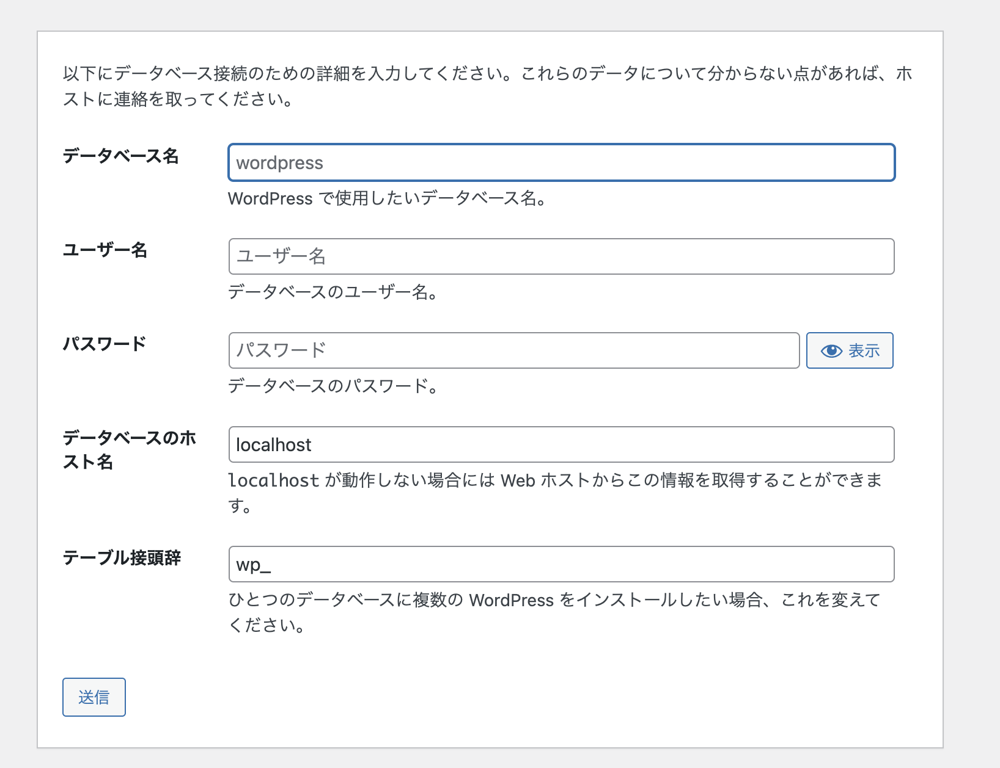
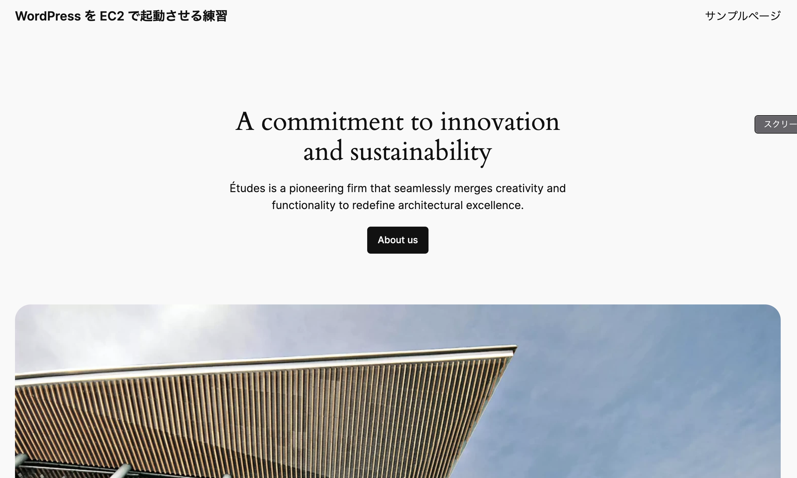

# 4. WowdPress を起動

## 4.1 WordPress を DL し解凍後に html ディレクトリに移動

```bash
sudo wget http://ja.wordpress.org/latest-ja.tar.gz
sudo tar -xzvf latest-ja.tar.gz
sudo cp -r wordpress/* /var/www/html
```

## 4.2 Apache サーバーが WordPress を読み取れるように設定し再起動

```bash
sudo chown apache:apache /var/www/html/ -R
sudo systemctl restart httpd.service
```

## 4.3 インストールした wordpress のバージョンを確認

```bash
cd /var/www/html/wp-includes
cat cat version.php

# $wp_version = '6.6.2';
```

## 4.4 EC2 インスタンスのパブリック IP アドレスをブラウザに入れて画面表示して以下の DB 情報を入力して完成

- パブリック IPv4 DNS の例: ec2-XX-XXX-XXX-XXX.ap-northeast-1.compute.amazonaws.com

  - もし接続できなかったら、SG に port80 が空いているか確認

- DB 情報入力画面
  - username: tamura_ko
  - password(user の pw?): rQe:b;bMd7dd
  - database: wordpress_db
  - host: localhost
    
- サイト情報入力画面(画像割愛)

  - サイト: WordPress を EC2 で起動させる練習
  - ユーザー名: kosuke
  - wp の pw: bn5sW&BnmmUpn)Hndc

- トップ画面を表示(管理画面も表示できる)
  
